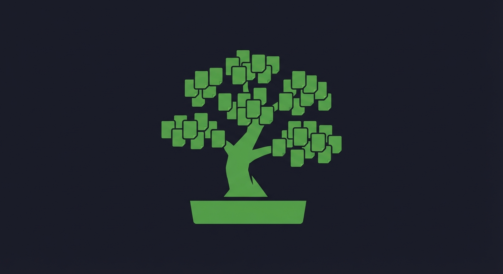
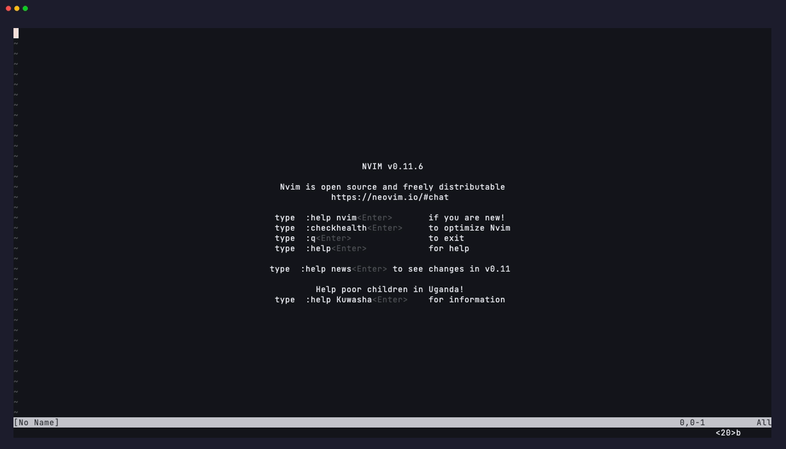

<div align="center">
  

  # okuban.nvim

  [](https://github.com/khwerhahn/okuban.nvim/actions/workflows/ci.yml)
  [](https://neovim.io)
  [](LICENSE)

  > 奥 (oku = deep/inner) + kanban — "deep kanban" or "inner board"
</div>

A Neovim plugin that turns GitHub issues into an interactive kanban board inside your editor. No GitHub Projects setup required — just issues and labels.

<div align="center">
  
</div>

## Status

**Beta** — Actively developed. Core features are functional. See [Roadmap](#roadmap) for what's shipped and what's coming.

## Why?

Existing solutions either:
- Are local file-based kanbans (no GitHub sync)
- Provide GitHub integration but no kanban view (octo.nvim)
- Require a GitHub Projects board to be set up first

okuban.nvim takes a different approach: your issues **are** your board. Add labels, open Neovim, and you have a kanban.

## Philosophy

okuban.nvim is **opinionated by design**. I built it for my own workflow — Neovim, tmux, and Claude Code in a terminal — where I wanted a kanban board that lives where I code, not in a browser tab I forget to check.

The plugin assumes a few things about how you work:
- **Issues are the source of truth** — Every task, bug, and feature is a GitHub issue. Labels drive the board, not a separate project configuration.
- **The terminal is home** — You navigate with the keyboard, your editor is always open, and context-switching to a browser is friction.
- **AI-assisted coding is part of the flow** — Claude Code can pick up issues from the board and work on them autonomously in git worktrees. This is optional — the kanban is fully functional without it.

These are my workflows and my opinions baked into defaults. I hope they help others who work the same way. If your workflow is different, nearly everything is configurable — columns, labels, keymaps, polling, split directions — so you can adapt it to fit.

**Key design decisions:**
- **Labels over Projects** — Zero setup. Works with any GitHub repo. No board configuration needed. GitHub Projects v2 is supported as an opt-in upgrade path for growing teams.
- **Terminal-native** — Built for developers who live in the terminal. No browser, no Electron, no mouse required.
- **Claude Code integration** — First-class support for AI-assisted coding directly from the board. Optional — the kanban works fully without it.
- **Everything configurable** — Columns, labels, keymaps, polling intervals, split directions — the defaults are intentional, but nothing is locked down.

## How It Works

Issues are sorted into columns based on labels. The plugin ships with an opinionated default label set (fully configurable):

| Label | Column | Color |
|-------|--------|-------|
| `okuban:backlog` | Backlog | `#c5def5` light blue |
| `okuban:todo` | Todo | `#0075ca` blue |
| `okuban:in-progress` | In Progress | `#fbca04` yellow |
| `okuban:review` | Review | `#d4c5f9` lavender |
| `okuban:done` | Done | `#0e8a16` green |

Issues without an `okuban:` label appear in an **Unsorted** column.

Moving a card between columns swaps labels automatically. No GitHub Projects board needed.

## Features

- **Preview pane** — Issue details (title, labels, assignees, body excerpt) displayed below the board. Automatically updates as you navigate between cards.
- **Auto-refresh** — The board refreshes from GitHub a limited number of times after opening (default: 3 fetches at 60s intervals), then stops to conserve API quota. A subtle staleness indicator in the header shows time since last update. Press `r` to refresh manually and restart the cycle.
- **Auto-focus** — On board open, okuban detects which issue you're working on from your git branch name, recent commit messages, or the `gh` CLI, and scrolls to that card. Press `g` to re-trigger.
- **Worktree status badges** — Cards show git worktree indicators: `○` (worktree exists, clean), `●` (worktree exists, dirty). The card for your active worktree is highlighted in orange.
- **Action menu** — Press `<CR>` on any card to open a floating menu with actions: move, view in browser, close, assign, or launch Claude Code.
- **Claude Code integration** — Launch autonomous Claude Code sessions directly from the board. Each session runs in its own git worktree with sandboxed tools and budget limits. In tmux, Claude runs in a visible pane so you can watch it work and follow up.

## Prerequisites

- Neovim 0.10+
- [GitHub CLI](https://cli.github.com) (`gh`) — installed and authenticated (`gh auth login`)
- [Claude Code](https://claude.ai/code) (`claude`) — optional, only for autonomous coding feature (must be installed and authenticated)
- [tmux](https://github.com/tmux/tmux) — optional, for interactive Claude sessions (Claude appears in a visible pane alongside Neovim)

## Installation

Using [lazy.nvim](https://github.com/folke/lazy.nvim):

```lua
{
  "khwerhahn/okuban.nvim",
  cmd = { "Okuban", "OkubanSetup", "OkubanSource", "OkubanMigrate" },
  keys = {
    { "<leader>bb", "<cmd>Okuban<cr>", desc = "Open kanban board" },
    { "<leader>bq", "<cmd>OkubanClose<cr>", desc = "Close kanban board" },
    { "<leader>br", "<cmd>OkubanRefresh<cr>", desc = "Refresh kanban board" },
    { "<leader>bs", "<cmd>OkubanSetup<cr>", desc = "Create kanban labels" },
    { "<leader>bS", "<cmd>OkubanSetup --full<cr>", desc = "Create all labels (full)" },
    { "<leader>bl", "<cmd>OkubanSource labels<cr>", desc = "Switch to label source" },
    { "<leader>bp", "<cmd>OkubanSource project<cr>", desc = "Switch to project source" },
    { "<leader>bm", "<cmd>OkubanMigrate project<cr>", desc = "Migrate labels to project" },
  },
  opts = {},
}
```

The simplest setup is just `opts = {}` — the `keys` and `cmd` entries above are optional (they enable lazy-loading and global keymaps). If you prefer minimal config:

```lua
{
  "khwerhahn/okuban.nvim",
  cmd = "Okuban",
  opts = {},
}
```

The `keys` entries register at startup (so `<leader>b` works immediately) and trigger lazy-loading on first use. The `cmd` entries let you use `:Okuban` etc. directly.

Using [vim-plug](https://github.com/junegunn/vim-plug):

```vim
Plug 'khwerhahn/okuban.nvim'
```

### Global Keymaps

okuban.nvim registers global keymaps on `setup()` using the `<leader>b` prefix (**b** for board):

| Key | Command | Description |
|-----|---------|-------------|
| `<leader>bb` | `:Okuban` | Open kanban board |
| `<leader>bq` | `:OkubanClose` | Close kanban board |
| `<leader>br` | `:OkubanRefresh` | Refresh kanban board |
| `<leader>bs` | `:OkubanSetup` | Create kanban labels |
| `<leader>bS` | `:OkubanSetup --full` | Create all labels (full set) |
| `<leader>bl` | `:OkubanSource labels` | Switch to label source |
| `<leader>bp` | `:OkubanSource project` | Switch to project source |
| `<leader>bm` | `:OkubanMigrate project` | Migrate labels to project |

Remap or disable any key via the `global_keymaps` config option:

```lua
require("okuban").setup({
  global_keymaps = {
    open = "<leader>ob",   -- remap to a different key
    migrate = false,       -- disable this keymap entirely
  },
})
```

## Quick Start

```vim
" 1. Create kanban column labels on your repo (one-time)
:OkubanSetup

" 1b. (Optional) Also create type, priority, and community labels
:OkubanSetup --full

" 2. Open the kanban board
:Okuban
```

## Configuration

All options with their defaults:

```lua
require("okuban").setup({
  -- Data source: "labels" (default) or "project" (GitHub Projects v2)
  source = "labels",

  -- GitHub Projects v2 settings (only used when source = "project")
  project = {
    number = nil,       -- project number (nil = show picker on first :Okuban)
    owner = nil,        -- project owner (nil = auto-detect from repo)
    done_limit = 20,    -- max items to show per column
  },

  -- Label-to-column mapping (only used when source = "labels")
  -- In project mode, columns are read from the project's Status field
  columns = {
    { label = "okuban:backlog",     name = "Backlog",     color = "#c5def5" },
    { label = "okuban:todo",        name = "Todo",        color = "#0075ca" },
    { label = "okuban:in-progress", name = "In Progress", color = "#fbca04" },
    { label = "okuban:review",      name = "Review",      color = "#d4c5f9" },
    { label = "okuban:done",        name = "Done",        color = "#0e8a16", state = "all", limit = 20 },
  },

  -- Show a column for issues without any okuban: label
  show_unsorted = true,

  -- Skip preflight checks (gh auth, repo scope)
  skip_preflight = false,

  -- GitHub hostname (for GitHub Enterprise Server)
  github_hostname = nil,

  -- Height of the preview pane below the board (0 to disable)
  preview_lines = 8,

  -- Show TLDR excerpt from issue body in the preview pane
  show_tldr = true,

  -- Auto-refresh interval in seconds (0 to disable)
  poll_interval = 60,

  -- Total auto-refreshes after board open (then stops, press r to restart)
  auto_refresh_count = 3,

  -- Global keymaps (set false to disable, or change the key)
  global_keymaps = {
    open           = "<leader>bb",
    close          = "<leader>bq",
    refresh        = "<leader>br",
    setup          = "<leader>bs",
    setup_full     = "<leader>bS",
    source_labels  = "<leader>bl",
    source_project = "<leader>bp",
    migrate        = "<leader>bm",
  },

  -- Board keymaps (all buffer-local to the board windows)
  keymaps = {
    column_left  = "h",
    column_right = "l",
    card_up      = "k",
    card_down    = "j",
    move_card    = "m",
    open_actions = "<CR>",
    goto_current = "g",
    close        = "q",
    refresh      = "r",
    help         = "?",
  },

  -- Claude Code integration (requires `claude` CLI)
  claude = {
    enabled = true,
    max_budget_usd = 5.00,      -- max spend per session
    max_turns = 30,             -- max agentic turns per session
    model = nil,                -- override model (e.g. "sonnet", "opus")
    launch_mode = "auto",       -- "auto" | "headless" | "tmux"
    max_concurrent_sessions = 3, -- max simultaneous Claude sessions
    launch_stagger_ms = 3000,   -- delay (ms) between consecutive launches
    allowed_tools = {
      "Bash(git:*)",
      "Bash(gh:*)",
      "Read",
      "Edit",
      "Write",
      "Glob",
      "Grep",
    },
    worktree_base_dir = nil,    -- nil = auto (../repo-worktrees/)
    auto_push = false,          -- push worktree branch on session complete
    auto_pr = false,            -- create PR on session complete
    tmux_split = {
      target = "auto",          -- "auto" | "self" | "other"
      direction = "v",          -- "v" (top/bottom) | "h" (side-by-side)
      size = nil,               -- pane size (e.g. "50%"), nil = tmux default
    },
    agent_teams = {
      enabled = false,          -- EXPERIMENTAL: Claude agent teams
      teammate_mode = "tmux",   -- "tmux" or "auto"
    },
  },
})
```

The Done column uses `state = "all"` to include closed issues and `limit = 20` to cap how many are fetched (for performance). Both are configurable per column.

### Highlight Groups

All highlight groups use `default = true`, so you can override them in your config:

| Group | Default Link | Used For |
|-------|-------------|----------|
| `OkubanCardFocused` | `CursorLine` | Currently selected card |
| `OkubanColumnHeader` | `Title` | Column header text |
| `OkubanCardActive` | `WarningMsg` | Card with an active git worktree (orange) |

Example override:
```lua
vim.api.nvim_set_hl(0, "OkubanCardFocused", { bg = "#2d3f76" })
vim.api.nvim_set_hl(0, "OkubanCardActive", { fg = "#ff9e64", bold = true })
```

## Commands

| Command | Description |
|---------|-------------|
| `:Okuban` | Open kanban board for the current repo |
| `:OkubanSetup` | Create kanban column labels on the repo |
| `:OkubanSetup --full` | Create kanban + type + priority + community labels |
| `:OkubanRefresh` | Refresh the current board |
| `:OkubanClose` | Close the kanban overlay |
| `:OkubanSource labels` | Switch to label-based board |
| `:OkubanSource project [N]` | Switch to project-based board (picker if no number) |
| `:OkubanMigrate project [N]` | Copy label board positions into a GitHub Project |
| `:OkubanTriage` | Interactively assign unsorted issues to kanban columns |

## Keybindings

### Board Navigation

All keybindings are buffer-local to the board windows and configurable via the `keymaps` option.

| Key | Action |
|-----|--------|
| `h` / `l` | Move between columns |
| `j` / `k` | Move between cards |
| `<CR>` | Open action menu on selected card |
| `m` | Move card to another column |
| `g` | Jump to auto-detected current issue |
| `r` | Refresh board |
| `q` | Close board |
| `?` | Show help |

### Action Menu

Press `<CR>` on any card to open the action menu:

| Key | Action |
|-----|--------|
| `m` | Move to column |
| `v` | View in browser |
| `c` | Close issue (open issues only) |
| `a` | Assign to me (open issues only) |
| `x` | Code with Claude (open issues, when available) |
| `q` / `<Esc>` | Dismiss menu |

## Label Setup

Run `:OkubanSetup` to create the 5 kanban column labels. Run `:OkubanSetup --full` to also create type, priority, and community labels.

See [docs/label-setup.md](docs/label-setup.md) for the full label reference with colors, descriptions, and manual `gh label create` commands.

## Roadmap

### Phase 1: Core Board
- [x] Preflight checks (gh auth, repo scope)
- [x] `:OkubanSetup` to create default labels
- [x] Fetch issues per label column via `gh issue list`
- [x] Multi-column floating window layout with sticky headers
- [x] Semantic hjkl navigation between columns and cards
- [x] Move cards between columns (label swap via `gh issue edit`)

### Phase 2: Smart Features
- [x] Auto-focus on current issue from git branch/commit context
- [x] Worktree status indicators per card (exists, dirty, active)
- [x] Action menu on cards (view, close, assign, code)
- [x] Preview pane with issue details below the board

### Phase 3: Autonomous Coding
- [x] Launch Claude Code sessions from the board (headless or interactive tmux mode)
- [x] Git worktree creation and management for isolated coding
- [x] Monitor running Claude sessions with live status badges
- [x] Interactive tmux pane splitting (Claude TUI visible alongside Neovim)
- [x] Session resume support (`claude --resume`)
- [x] Post-completion actions (auto-push, auto-PR)
- [x] Auto-move issue to In Progress on launch
- [x] Structured prompts with context-gathering instructions
- [x] Experimental agent teams support

### Phase 4: Polish & Community
- [x] GitHub Actions CI (tests, StyLua, Luacheck)
- [x] Issue templates, PR template, CONTRIBUTING.md

### v1.0: GitHub Projects v2
- [x] GitHub Projects v2 as an alternative data source (GraphQL API)
- [x] `:OkubanSource` command for runtime source switching
- [x] `:OkubanMigrate` command for one-time label→project migration
- [ ] Custom field support (priority, iteration, size) on cards

## FAQ

**Do I need GitHub Projects?**
No. By default, okuban.nvim uses GitHub issue labels as its data source. You only need issues and labels — no Projects board setup required.

If your team already uses a GitHub Project, you can switch to it as the data source with `:OkubanSource project`. Columns are read from the project's Status field instead of labels. See [GitHub Projects v2](#github-projects-v2) below.

**Can I customize the columns?**
Yes. Pass a `columns` table to `setup()` with your own labels, names, and colors:
```lua
require("okuban").setup({
  columns = {
    { label = "status:new",  name = "New",  color = "#c5def5" },
    { label = "status:wip",  name = "WIP",  color = "#fbca04" },
    { label = "status:done", name = "Done", color = "#0e8a16", state = "all", limit = 50 },
  },
})
```

**How does auto-focus work?**
When you open the board, okuban tries to detect which issue you're working on using a three-tier cascade:
1. **Branch name** — Parses patterns like `feat/issue-42-description`, `fix/123-null-check`, or `GH-42-oauth`
2. **Recent commits** — Scans the last 5 commit messages for `#N` references
3. **gh CLI** — Queries for issues assigned to you with the `okuban:in-progress` label

Press `g` at any time to re-run detection and jump to the matched card.

**What are the worktree badges?**
Cards show git worktree status when a linked worktree exists:
- `○` — worktree exists, working tree is clean
- `●` — worktree exists, working tree has uncommitted changes
- Orange highlight — this is your currently active worktree

**How does Claude Code integration work?**
From the action menu (`<CR>` then `x`), okuban:
1. Auto-moves the issue to **In Progress** (swaps the kanban label)
2. Creates a git worktree for isolated coding (`feat/issue-N-claude` branch)
3. Fetches the issue context (title, body, labels, comments)
4. Launches Claude Code with sandboxed tools and a budget cap

In **tmux mode** (default when inside tmux), Claude runs in a visible pane split from your current window — you can watch it work and follow up. In **headless mode**, it runs as a background job. Session badges appear on cards: `[▶]` running, `[✓]` completed, `[✗]` failed. Completed sessions can be resumed from the action menu.

Claude receives structured instructions to read CLAUDE.md, explore the codebase, and state assumptions before coding. A system prompt enforces commit references, feature branches, and kanban labels.

See [Feature Architecture § Autonomous Claude Code Sessions](docs/feature-architecture.md#8-autonomous-claude-code-sessions) for the full technical design.

**Can I use this with GitHub Enterprise?**
Yes. Set the `github_hostname` option:
```lua
require("okuban").setup({
  github_hostname = "github.mycompany.com",
})
```

**How do I disable auto-refresh?**
Set `poll_interval` to 0:
```lua
require("okuban").setup({
  poll_interval = 0,
})
```

**Why is the Done column limited to 20 issues?**
The Done column includes closed issues (`state = "all"`), which can grow large over time. The default `limit = 20` keeps the board responsive. You can change this per column:
```lua
columns = {
  -- ...
  { label = "okuban:done", name = "Done", color = "#0e8a16", state = "all", limit = 100 },
},
```

## GitHub Projects v2

okuban supports GitHub Projects v2 as an alternative data source. Instead of reading labels, the board reads from a project's Status field.

### Upgrade Path

1. **Start with labels** (default, zero config) — run `:OkubanSetup`, use `:Okuban`
2. **Create a GitHub Project** via the web UI, add issues, configure Status columns
3. **Switch to the project** — run `:OkubanSource project` in Neovim, pick your project
4. **Migrate cards** (optional) — run `:OkubanMigrate project` to copy label-based positions into the project
5. **Switch back** any time — run `:OkubanSource labels`

### Requirements

GitHub Projects v2 requires the `project` OAuth scope (not included by default):

```bash
gh auth refresh -s project
```

### Permanent Config

To always use a project as the data source:

```lua
require("okuban").setup({
  source = "project",
  project = {
    number = 1,        -- your project number
    owner = "myorg",   -- user or org that owns the project
  },
})
```

If `number` is `nil`, okuban shows a picker on first open. If `owner` is `nil`, it auto-detects from the git remote.

### How It Works

- Columns come from the project's **Status** field options (the same ones that drive the board view on github.com)
- Moving a card updates the Status field value via `gh project item-edit`
- `:OkubanSetup` only creates labels — it never creates or modifies projects
- Issues, labels, assignees, and body are still read from the issue itself (not project fields)

## Troubleshooting

**"gh CLI not found"**
Install from https://cli.github.com, then run `gh auth login`.

**"Not authenticated with GitHub"**
Run `gh auth login` and follow the prompts.

**"Labels not showing up"**
Run `:OkubanSetup` to create the default labels, then assign them to your issues.

**"GitHub Projects requires additional permissions"**
Run `gh auth refresh -s project` to add the `project` scope. This is only needed when using `source = "project"`.

**"Claude Code not available"**
Install Claude Code from https://claude.ai/code. This is optional — the board works fully without it.

**"tmux not available"**
Claude defaults to headless mode if you're not inside tmux. To use interactive mode with a visible Claude pane, start Neovim inside a tmux session. You can also force headless mode: `claude = { launch_mode = "headless" }`.

**Claude Code sessions hang or freeze (SQLite contention)**
This is a known upstream issue in Claude Code. Each `claude` process shares a SQLite database (`~/.claude/__store.db`), and Claude Code currently uses `journal_mode=DELETE` with `busy_timeout=0`, which means concurrent writers can deadlock. This affects any scenario where multiple Claude processes run simultaneously — including okuban-launched sessions alongside an interactive Claude Code session.

**Mitigation:** okuban staggers session launches (3s delay between each) and caps concurrent sessions at 3 by default. You can tune these:
```lua
require("okuban").setup({
  claude = {
    max_concurrent_sessions = 2,  -- lower if you still see hangs
    launch_stagger_ms = 5000,     -- increase delay between launches
  },
})
```

**Root cause fix:** This must be addressed by Anthropic — switching Claude Code's SQLite to WAL mode and adding a nonzero `busy_timeout`. Track progress at [anthropics/claude-code#14124](https://github.com/anthropics/claude-code/issues/14124).

**Board looks wrong after resizing the terminal**
The board automatically repositions on `VimResized`, but if something looks off, press `r` to refresh or reopen with `:Okuban`.

## Development

```bash
# Run tests
make test

# Run lint (StyLua + Luacheck)
make lint

# Run both (same as CI)
make check

# Auto-format with StyLua
make format
```

See [CONTRIBUTING.md](CONTRIBUTING.md) for the full development guide.

## Contributing with Claude Code

This repo includes a `.claude/` directory with workflow automation for contributors using [Claude Code](https://claude.ai/code). **If you're not using Claude Code, you can ignore this entirely — the plugin and contribution process work the same way.**

When you clone or fork the repo with Claude Code installed, you automatically get:

**Custom skills** (slash commands):
| Command | What it does |
|---------|-------------|
| `/start-issue 42` | Assigns the issue, creates a branch, sets the kanban label, comments |
| `/close-issue 42` | Moves label to done, comments, closes the issue |
| `/lua-lint` | Runs StyLua + Luacheck on the codebase |
| `/nvim-test` | Runs plenary.nvim tests in headless mode |

**Enforcement hooks** (automatic):
- Commits without an issue reference (`Fixes #42`, `Refs #42`) are **blocked**
- Session start auto-detects which issue you're working on from the branch name

See [docs/claude-code-workflow.md](docs/claude-code-workflow.md) for the full guide.

## Design Docs

- [Feature Architecture](docs/feature-architecture.md) — Detailed design for all core features
- [Label Setup](docs/label-setup.md) — Full label reference with colors, descriptions, and `gh` commands
- [Claude Code Workflow](docs/claude-code-workflow.md) — How to use Claude Code with this project
- [Project Architecture & Decisions](CLAUDE.md) — Design philosophy, label system rationale, technical architecture

## License

MIT
